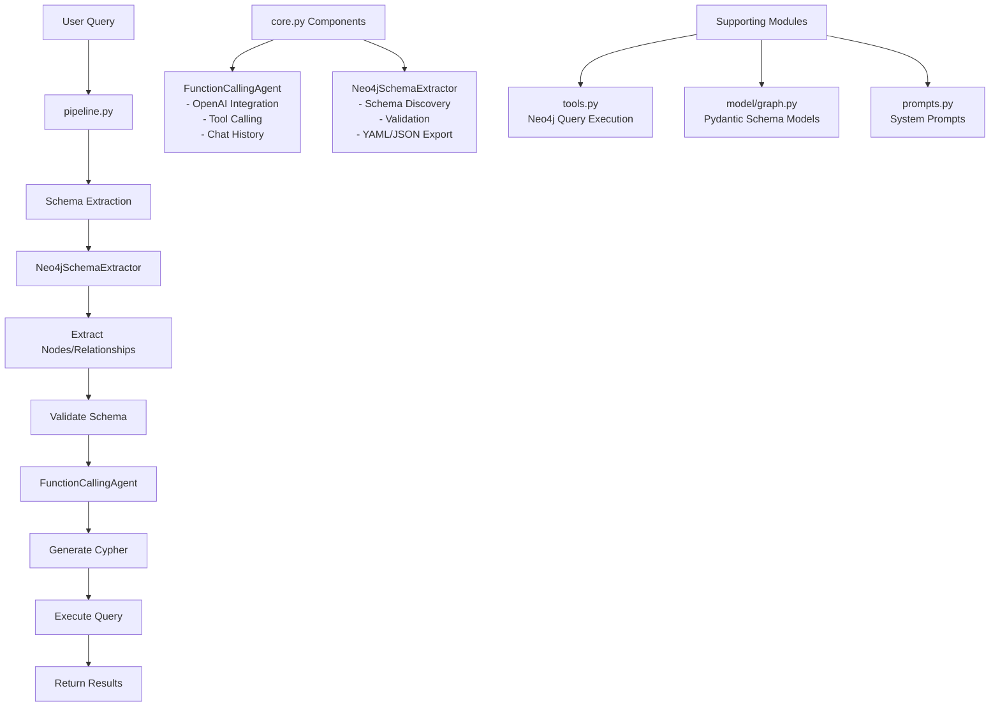

# KG_Demo - Neo4j Knowledge Graph Assistant

## Project Structure
```
KG_Demo/
├── config/
│   ├── constants.py          # Configuration constants
│   ├── schema.yaml           # Graph schema definition
│   └── example_schema.yaml   # Schema examples
├── src/
│   ├── core.py              # Main classes (FunctionCallingAgent, Neo4jSchemaExtractor)
│   ├── pipeline.py          # Processing pipeline
│   ├── tools.py             # Neo4j query tools
│   ├── prompts.py           # System prompts
│   ├── utils.py             # Utility functions
│   ├── cypher_gen.py        # Cypher generation
│   ├── context/
│   │   └── manager.py       # Context management
│   └── model/
│       └── graph.py         # Pydantic schema models
├── tests/                   # Test files
├── main.py                  # Entry point
└── pyproject.toml          # Dependencies
```

## Core Functionality (core.py)

### FunctionCallingAgent
- **OpenAI Integration**: Async chat completions with tool calling
- **Tool Execution**: Handles Neo4j query execution with rich console output
- **Chat Management**: Maintains conversation history with streaming support
- **Error Handling**: Robust error handling with iteration limits

### Neo4jSchemaExtractor
- **Schema Discovery**: Extracts nodes, relationships, constraints, and indexes
- **Validation**: Uses Pydantic models for schema validation
- **Export Formats**: Supports JSON and YAML output
- **Connection Management**: Handles Neo4j driver lifecycle

## Pipeline Flow



## TODO List

### Context Manager Enhancement
- [ ] **Schema Context Management**: Implement ContextManager for caching and managing graph schema information across sessions
- [ ] **Chat History Persistence**: Add persistent storage for conversation history with session management
- [ ] **Dynamic Schema Updates**: Real-time schema refresh when database structure changes

### Intelligent Mapping System
- [ ] **Embedding-Based Mapping**: Use vector embeddings to match user queries with relevant graph attributes
- [ ] **Semantic Search**: Implement semantic similarity search for finding the most relevant nodes/relationships
- [ ] **Query Optimization**: Intelligent query planning based on schema analysis and user intent

### Advanced Features
- [ ] **Multi-hop Reasoning**: Support complex multi-step queries across graph relationships
- [ ] **Result Ranking**: Implement relevance scoring for query results
- [ ] **Auto-completion**: Provide intelligent suggestions for graph traversal paths

## Documentation

- **[Schema Extraction Guide](schema_extraction.md)** - Detailed explanation of the schema extraction process, data structures, and Cypher queries used

## Quick Start

```bash
# Install dependencies
pip install -e .

# Set environment variables
export NEO4J_URI="bolt://localhost:7687"
export NEO4J_USER="neo4j"
export NEO4J_PASSWORD="password"
export OPENAI_API_KEY="your-key"

# Run interactive chat
python main.py
```