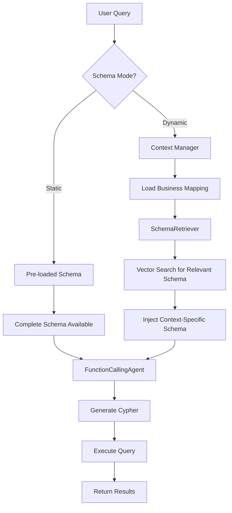
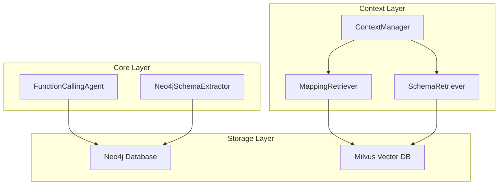

# KG_Demo - Neo4j Knowledge Graph Assistant

A sophisticated knowledge graph chat assistant with dynamic schema loading and intelligent context management for Neo4j databases.

## Project Structure

```
KG_Demo/
├── config/
│   ├── constants.py          # Configuration constants
│   ├── schema.yaml           # Graph schema definition
│   └── example_schema.yaml   # Schema examples
├── scripts/
│   ├── init_milvus.py        # Milvus database initialization
│   ├── node_schema.py        # Node schema extraction and sync
│   ├── sync_milvus.py        # Business mapping synchronization
│   └── sync.sh               # Complete sync workflow
├── src/
│   ├── core.py              # Main classes (FunctionCallingAgent, Neo4jSchemaExtractor)
│   ├── pipeline.py          # Processing pipeline with schema mode support
│   ├── tools.py             # LLM-callable functions (query_neo4j, get_schema_info)
│   ├── utils.py             # Utility functions (Neo4j operations, schema helpers)
│   ├── prompts.py           # System prompts (static & dynamic modes)
│   ├── logger.py            # Structured logging system
│   ├── context/
│   │   ├── manager.py       # Context management with schema mode support
│   │   └── retriever.py     # MappingRetriever & SchemaRetriever classes
│   ├── model/
│   │   ├── graph.py         # Pydantic schema models
│   │   ├── schema.py        # NodeSchema and Pattern models
│   │   └── mapping.py       # Business mapping models
│   └── storage/             # (Removed - moved to context/retriever.py)
├── tests/                   # Test files
├── main.py                  # Entry point
└── pyproject.toml          # Dependencies
```

## Key Features

### 🔄 **Dual Schema Loading Modes**
- **Static Mode**: Pre-loads complete schema at startup for comprehensive coverage
- **Dynamic Mode**: On-demand schema retrieval based on query context for efficiency

### 🧠 **Intelligent Context Management**
- **Business Term Mapping**: Automatic mapping between user terms and graph schema
- **Dynamic Schema Injection**: Context-aware schema retrieval using vector embeddings
- **Multi-Resource Context**: Integrated mapping and schema information in conversations

### 🚀 **Advanced Query Processing**
- **Function Calling Agent**: OpenAI-powered agent with tool calling capabilities
- **Cypher Generation**: Intelligent Cypher query generation with error handling
- **Streaming Responses**: Real-time response streaming with Rich console formatting

## Core Functionality (core.py)

### FunctionCallingAgent

- **OpenAI Integration**: Async chat completions with tool calling
- **Tool Execution**: Handles Neo4j query execution with rich console output
- **Chat Management**: Maintains conversation history with streaming support
- **Error Handling**: Robust error handling with iteration limits

### Neo4jSchemaExtractor

- **Schema Discovery**: Extracts nodes, relationships, constraints, and indexes
- **Validation**: Uses Pydantic models for schema validation
- **Export Formats**: Supports JSON and YAML output
- **Connection Management**: Handles Neo4j driver lifecycle

## Architecture Overview

### Schema Loading Modes



### Component Architecture



## Usage

### Command Line Options

```bash
# Static schema mode (default) - pre-loads complete schema
python main.py --schema-mode static

# Dynamic schema mode - on-demand schema retrieval
python main.py --schema-mode dynamic
```

### Schema Modes Comparison

| Feature             | Static Mode                 | Dynamic Mode                |
| ------------------- | --------------------------- | --------------------------- |
| **Startup Time**    | Slower (schema extraction)  | Faster (no pre-loading)     |
| **Memory Usage**    | Higher (full schema cached) | Lower (minimal schema)      |
| **Query Speed**     | Faster (schema ready)       | Moderate (retrieval needed) |
| **Schema Coverage** | Complete                    | Context-relevant            |
| **Best For**        | Comprehensive queries       | Targeted queries            |

### Data Synchronization

```bash
# Initialize and sync all data
./scripts/sync.sh

# Individual steps
python scripts/init_milvus.py        # Initialize Milvus collections
python scripts/node_schema.py        # Extract and sync node schemas
python scripts/sync_milvus.py --insert  # Sync business mappings
```

## Component Details

### Context Management (`src/context/`)

- **ContextManager**: Orchestrates context loading with schema mode awareness
- **MappingRetriever**: Retrieves business term mappings using vector search
- **SchemaRetriever**: Dynamically retrieves relevant schema information

### Tools & Utils Separation

- **tools.py**: Functions callable by LLM agents (`query_neo4j`, `get_schema_info`)
- **utils.py**: Utility functions for Neo4j operations and schema processing

### Logging & Monitoring

- **Structured Logging**: Detailed logging of LLM calls, context loading, and errors
- **Background Logging**: Non-intrusive logging to files (respects Rich console output)

## Development Status

### ✅ Completed Features

- [X] **Dual Schema Loading Modes**: Static and dynamic schema loading
- [X] **Intelligent Context Management**: Integrated mapping and schema retrieval
- [X] **Code Refactoring**: Clean separation of concerns and modular architecture
- [X] **Vector-Based Retrieval**: Embedding-based context and schema retrieval
- [X] **Async Context Loading**: Non-blocking context and schema loading
- [X] **Rich Console Interface**: Beautiful terminal UI with mode indicators

### 🔄 In Progress

- [ ] **Performance Optimization**: Query caching and result optimization
- [ ] **Error Recovery**: Enhanced error handling and recovery mechanisms
- [ ] **Testing Coverage**: Comprehensive test suite for all components

### 📋 Planned Features

- [ ] **Multi-Database Support**: Support for multiple Neo4j instances
- [ ] **Query Templates**: Pre-built query templates for common patterns
- [ ] **Result Visualization**: Graph visualization for query results

## Documentation

- **[Schema Extraction Guide](docs/schema_extraction.md)** - Detailed explanation of the schema extraction process
- **[Cypher Generation](docs/cypher.md)** - Guide to Cypher query generation and optimization

## Troubleshooting

### Common Issues

1. **Milvus Connection Failed**
   ```bash
   # Ensure Milvus is running or initialize collections
   python scripts/init_milvus.py
   ```

2. **Schema Retrieval Errors**
   ```bash
   # Re-sync node schemas
   python scripts/node_schema.py
   ```

3. **Context Loading Failures**
   ```bash
   # Re-sync business mappings
   python scripts/sync_milvus.py --insert
   ```

## Quick Start

### 1. Installation

```bash
# Install dependencies
uv sync  # or pip install -e .
```

### 2. Environment Setup

```bash
# Neo4j Configuration
export NEO4J_URI="bolt://localhost:7687"
export NEO4J_USER="neo4j"
export NEO4J_PASSWORD="password"
export NEO4J_DATABASE="neo4j"

# OpenAI Configuration
export OPENAI_API_KEY="your-openai-key"
export OPENAI_BASE_URL="https://api.openai.com/v1"  # or your proxy

# Ollama Configuration (for embeddings)
export OLLAMA_HOST="http://localhost:11434"
```

### 3. Data Initialization

```bash
# Initialize and sync all data
./scripts/sync.sh
```

### 4. Run the Assistant

```bash
# Static schema mode (comprehensive)
python main.py --schema-mode static

# Dynamic schema mode (efficient)
python main.py --schema-mode dynamic
```

### 5. Interactive Commands

- `help` - Show available commands
- `clear` - Clear chat history
- `quit/exit/bye` - End session

## Configuration

### Business Mappings

Edit `config/constants.py` to customize business term mappings:

```python
BUSINESS_MAPPING = {
    "业务术语": ["对应的图谱字段1", "对应的图谱字段2"],
    # Add more mappings...
}
```

### Schema Extraction

Customize schema extraction in `config/schema.yaml` for specific node types and relationships.
